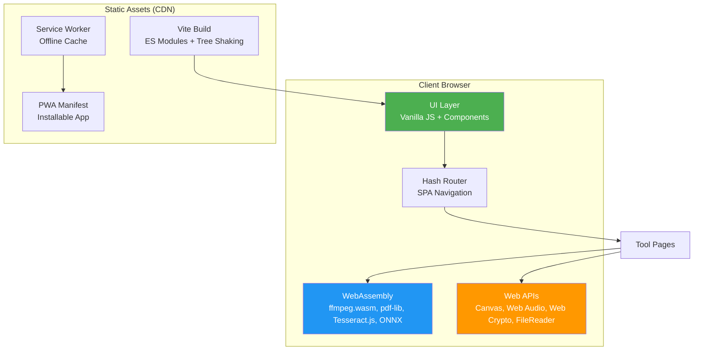

# ToolBox

> 344 free online tools — 100% client-side. Your files never leave your device.

[](https://opensource.org/licenses/MIT)
[](#categories)
[](#build-progress)
[](#stack)

[](https://star-history.com/#tamer4osman/xtoolbox&Date)

## Why ToolBox?

Most free online tools upload your files to a server. ToolBox processes everything **in your browser** using WebAssembly, Canvas API, and Web Crypto. No uploads. No accounts. No tracking.

**Alternatives like [123apps](https://123apps.com), [iLovePDF](https://www.ilovepdf.com), and [TinyPNG](https://tinypng.com)** require server uploads. ToolBox gives you the same tools with zero privacy trade-offs.

## Quick Start

```bash
npm install
npm run dev        # → localhost:3000
npm run build      # → dist/
npm run test       # → Playwright tests
```

## Stack

| Layer  | Technology                   | Purpose                                  |
| ------ | ---------------------------- | ---------------------------------------- |
| Build  | Vite                         | Fast HMR, ES modules                     |
| UI     | Vanilla JS                   | Zero framework overhead                  |
| PDF    | pdf-lib, PDF.js, jsPDF       | Client-side PDF manipulation             |
| Video  | ffmpeg.wasm                  | Browser-native video processing          |
| Image  | Canvas API, Pica, Cropper.js | Real-time image transforms               |
| OCR    | Tesseract.js                 | In-browser optical character recognition |
| ML     | ONNX Runtime Web             | Embedded AI models (≤100MB)              |
| Audio  | Web Audio API, lamejs        | Sound processing and encoding            |
| Crypto | Web Crypto API               | Hashing, HMAC, encryption                |

## Features

| Capability          | Description                                                   |
| ------------------- | ------------------------------------------------------------- |
| **Privacy-first**   | Zero server uploads — all processing happens in your browser  |
| **344 tools**       | PDF, image, video, audio, text, code, math, finance, and more |
| **No accounts**     | No sign-ups, no tracking, no data collection                  |
| **Offline-capable** | Service worker + PWA — works without internet                 |
| **Mobile-friendly** | Responsive design, works on phones and tablets                |
| **Open source**     | MIT license — inspect, modify, and deploy freely              |

## Categories

| Category               | Built | Status      | Key Libraries                                |
| ---------------------- | ----- | ----------- | -------------------------------------------- |
| **Image**              | 43    | ✅ Complete | Canvas API, Cropper.js, Pica, ONNX, heic2any |
| **Developer**          | 40    | ✅ Complete | Custom JS, CodeMirror, sql.js                |
| **Text & Content**     | 35    | ✅ Complete | marked, turndown, js-yaml, SheetJS           |
| **PDF**                | 33    | ✅ Complete | pdf-lib, PDF.js, jsPDF                       |
| **Video**              | 26    | ✅ Complete | ffmpeg.wasm                                  |
| **CSS & Web Design**   | 20    | ✅ Complete | Custom JS                                    |
| **Audio**              | 17    | ✅ Complete | Web Audio API, lamejs, Wavesurfer.js         |
| **Business**           | 16    | ✅ Complete | Custom JS, jsPDF                             |
| **Finance**            | 16    | ✅ Complete | Chart.js                                     |
| **Productivity**       | 18    | ✅ Complete | Custom JS                                    |
| **Math**               | 13    | ✅ Complete | math.js                                      |
| **Health**             | 12    | ✅ Complete | Custom JS                                    |
| **Encoding & Hashing** | 9     | ✅ Complete | Web Crypto API                               |
| **SEO**                | 8     | ✅ Complete | Custom JS                                    |
| **Reference**          | 8     | ✅ Complete | Free Dictionary API, Open Library            |
| **Privacy & Security** | 8     | ✅ Complete | Web Crypto API                               |
| **Fun & Games**        | 6     | ✅ Complete | Custom JS                                    |
| **QR & Barcode**       | 4     | ✅ Complete | qrcode, JsBarcode                            |
| **OCR**                | 4     | ✅ Complete | Tesseract.js                                 |
| **Visualization**      | 4     | ✅ Complete | Chart.js, Papa Parse                         |
| **Weather**            | 4     | ✅ Complete | wttr.in, Open-Meteo                          |

**Total:** 319 built, 25 planned = 344 tools

## Architecture



## Build Progress

27 of 28 phases complete. Phase 28 (Legacy Catch-Up) in progress.

| Phase                    | Tools | Status         |
| ------------------------ | ----- | -------------- |
| 1–19: Foundation         | 200+  | ✅ Complete    |
| 20: Launch               | —     | ✅ Complete    |
| 21: Market Expansion     | 33    | ✅ Complete    |
| 22: Format Converters    | 11    | ✅ Complete    |
| 23: Gap Fill             | 20    | ✅ Complete    |
| 24: Privacy & Utility    | 18    | ✅ Complete    |
| 25: Most Wanted          | 23    | ✅ Complete    |
| 26: Uncommon High-Demand | 16    | ✅ Complete    |
| 27: High-Demand          | 19    | ✅ Complete    |
| 28: Legacy Catch-Up      | 6/37  | 🟡 In Progress |

## Project Structure

```text
toolbox/
├── src/
│   ├── main.js              ← App bootstrap
│   ├── router.js            ← Hash-based SPA router
│   ├── styles/              ← Design tokens + components
│   ├── components/          ← 15 reusable UI components
│   ├── utils/               ← Shared utilities
│   ├── pages/               ← Page templates
│   ├── tools/               ← 315 tool implementations
│   │   ├── pdf/             ← 33 PDF tools
│   │   ├── image/           ← 39 image tools
│   │   ├── video/           ← 19 video tools
│   │   ├── audio/           ← 15 audio tools
│   │   ├── dev/             ← 34 developer tools
│   │   ├── text/            ← 35 text tools
│   │   └── ...              ← 15 more categories
│   └── data/                ← tools.json, categories.json
├── public/                  ← Static assets
└── tests/                   ← Playwright E2E tests
```

## Tool Criteria

All tools follow the **100% client-side** philosophy:

| ✅ Good Fit                                       | ❌ Bad Fit                 |
| ------------------------------------------------- | -------------------------- |
| Pure browser APIs (Canvas, Web Audio, FileReader) | Requires server backend    |
| WASM modules (pdf-lib, ffmpeg.wasm, Tesseract.js) | Requires authentication    |
| Input → process → output pipeline                 | Real-time multiplayer      |
| Public APIs without API keys                      | Generative AI / LLMs       |
| Embedded ML models (≤100MB)                       | Niche industrial use cases |

## Contributing

1. **Fork** the repository
2. **Create** a branch: `git checkout -b feature/your-tool`
3. **Build** your tool in `src/tools/<category>/<tool-id>.js`
4. **Add** entry to `src/data/tools.json` and `toolsList.json`
5. **Write** unit tests in `src/__tests__/`
6. **Run** checks: `npm run build && npm run test:unit`
7. **Submit** a pull request

See [AGENTS.md](AGENTS.md) for the full 20-step tool-building workflow.

## Deploy

Built for [Cloudflare Pages](https://pages.cloudflare.com/) (free tier).

```bash
npm run build    # → dist/
# Push to GitHub → Connect repo → Auto-deploy
```

## License

[MIT](https://opensource.org/licenses/MIT) — use freely in personal and commercial projects.
